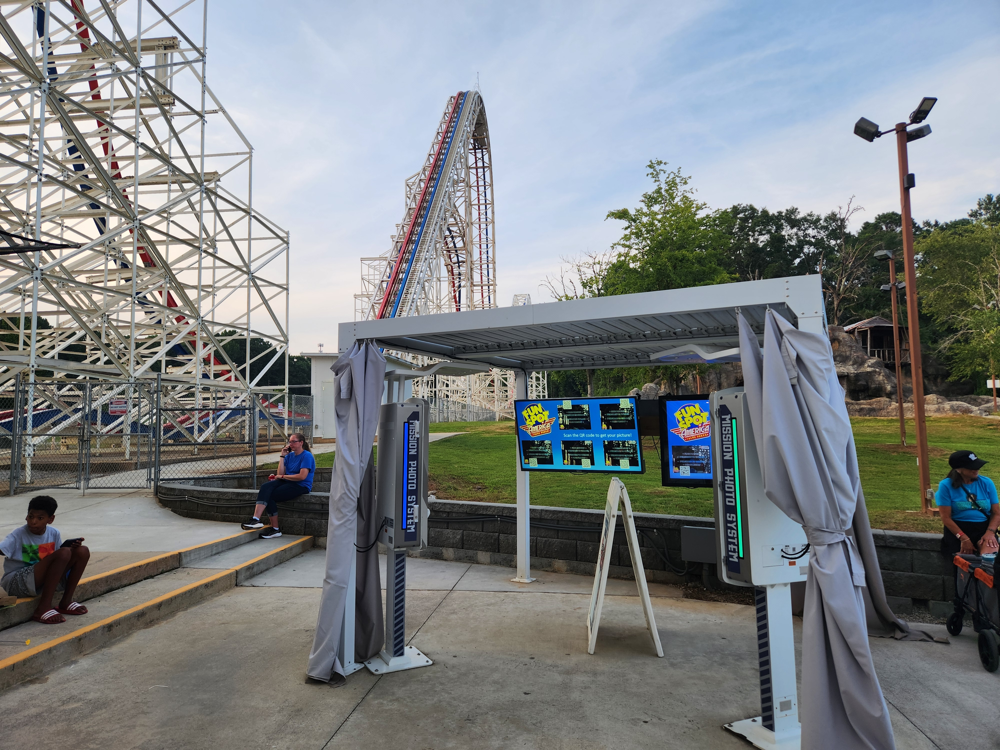
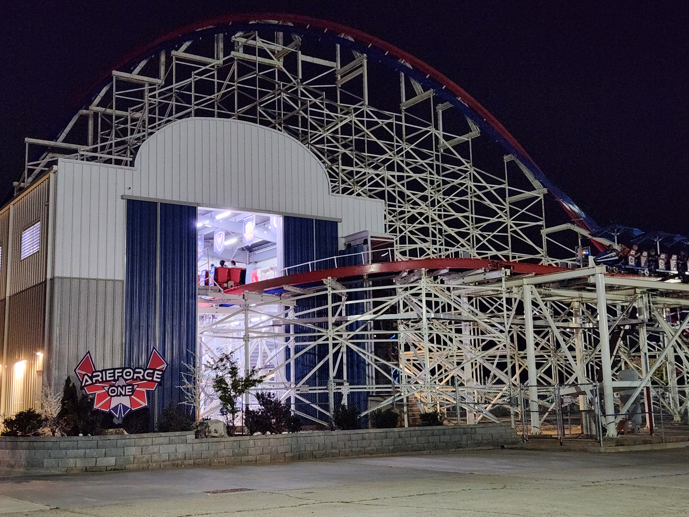
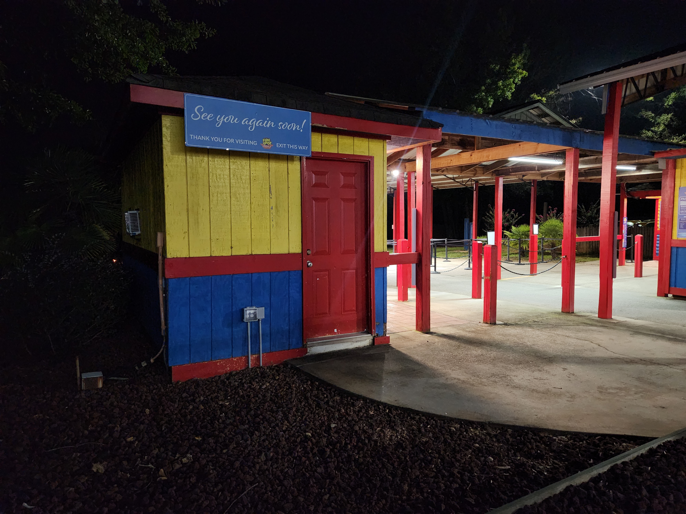

+++
title = "Goodbye, ArieForce One"
date = "2026-08-18"
description = "reminiscing on one of the most unique coasters ever built"
tags = ["amusement-parks", "coasters"]
toc = false
+++
I'm a bit late to writing this one, but I'm here nevertheless. The last night that I got to ride ArieForce One was on July 31, 2026, and what a night it was. Over the past three years I have *never* seen Fun Spot Atlanta as packed as it was that night. Luckily, I had got up there earlier in the week to get some laps in, because on this evening, I was only able to ride once. Even though I only got one ride, it was one of the most worthwhile trips to a park I've ever had.



Never in my life have I ever seen a coaster look as out of place as ArieForce One. It was, as many others have pointed out, literally a world-class coaster sitting in a parking lot with a bunch of carnival rides and a few janky go-kart tracks (*fun*, janky go-kart tracks). Never have I seen a park be as thoroughly attended by nearly exclusively coaster enthusiasts as in the opening and closing months of this coaster. Never have I seen a ride have so much culture around it, like how we were all playing rock-paper-scissors upside-down during the Zero-G Stall that first year. No two back-to-back elements will ever compare to the Double-Up into the Arcade Roll. Nothing will ever be as uniquely bizarre and euphoric as lapping ArieForce One with maybe two other riders when it was the only thing open in the park, during the "Weekday Special."

Every part of this funny little park will remain with me in my memories for the rest of time. The arcade, the go-karts, the Time Tunnel, the rare Paratrooper that got moved during the time I visited. All of this silly place was special to me, and always will be. I'm clearly not alone when I say this, but I ***hope*** so badly that ArieForce One gets relocated. <3

