+++
title = "Dollywood Park Review"
date = "2026-08-06"
description = "A review of my spring trip to Dollywood"
tags = ["amusement-parks", "reviews", "coasters"]
toc = false
+++
For reasons unbeknownst to me, Hilton Grand Vacations keeps offering me 3-day, 4-night hotel packages at an extremely discounted rate — even free, sometimes. Despite my repeated honesty regarding my (poor) financial situation, I was offered another trip sometime last year, and one of the options was Gatlinburg, TN. Considering my coaster enthusiast proclivities and the fact that one of the hotels offered to me was extraordinarily close to Dollywood, I naturally chose this option. This review will cover my 2-day visit that took place in March of this year.

## Roller Coasters

---

I will be ranking these coasters from what I consider to be worst to best, with one notable coaster excluded.

### Mystery Mine
Mystery Mine was in its final stages of testing following its refurbishment during the two days I visited the park, so unfortunately I am unable to review this coaster.

### Whistle Punk Chaser
It should come as no surprise that the park's resident kiddie coaster begins our list in the #9 spot. This Zamperla model is pretty standard, so I don't have a lot of thoughts on it. You get three laps. The set piece with the smoke coming out looked nice, and it was cool to learn what a [whistle punk](https://www.merriam-webster.com/dictionary/whistle%20punk) is.

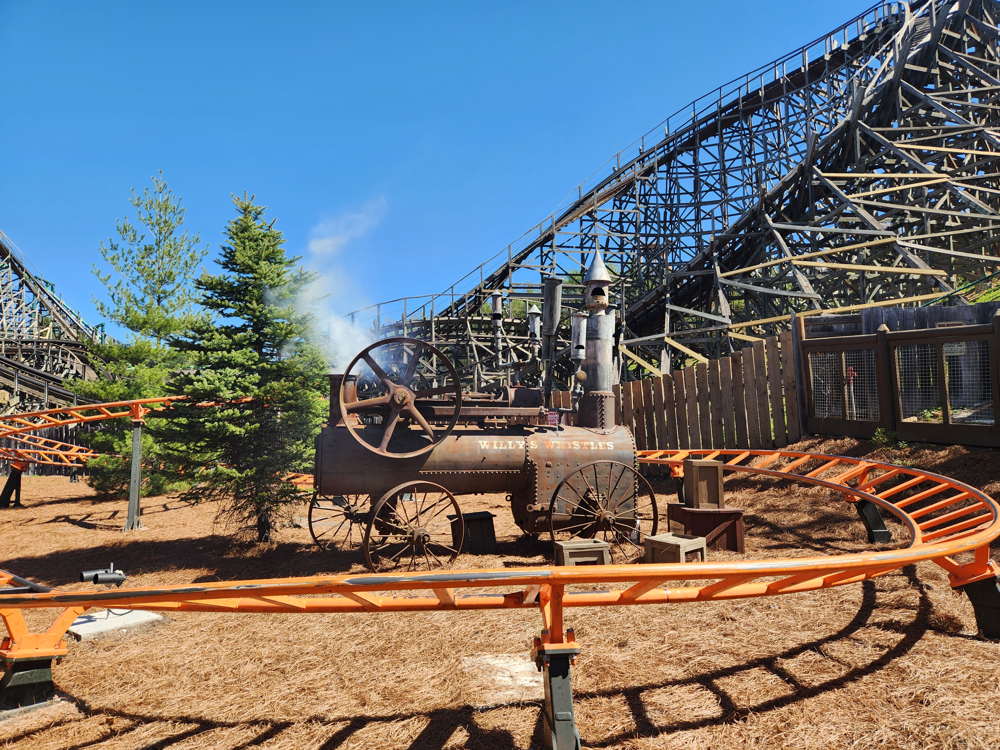

### Dragonflier
Freedom Flyer, the Vekoma Suspended Family Coaster situated at Fun Spot Orlando, has endeared itself to me over the years by virtue of being a smooth, fun experience. It makes a lot of sense at that park, too — Fun Spot's small setting lets a relatively small coaster model feel more imposing than it normally would, and offers a nice view of all of the flat rides and White Lightning. Why am I talking about a coaster hundreds of miles away? Because, in my mind, Dragonflier fills that same niche almost exactly. It's the same ride model, so it makes sense that it would, but it being at this much larger theme park makes me less interested in it. I'm sure that families love riding this with their kids, and I have absolutely no complaints about it, don't get me wrong, but Dragonflier isn't something that I think I will be riding again on future visits. All that being said, I love the entire *Wildwood Grove* area, and I must give Dragonflier credit for contributing to its natural, ethereal aura through its color palette, theming, and ability to evoke childlike wonder.

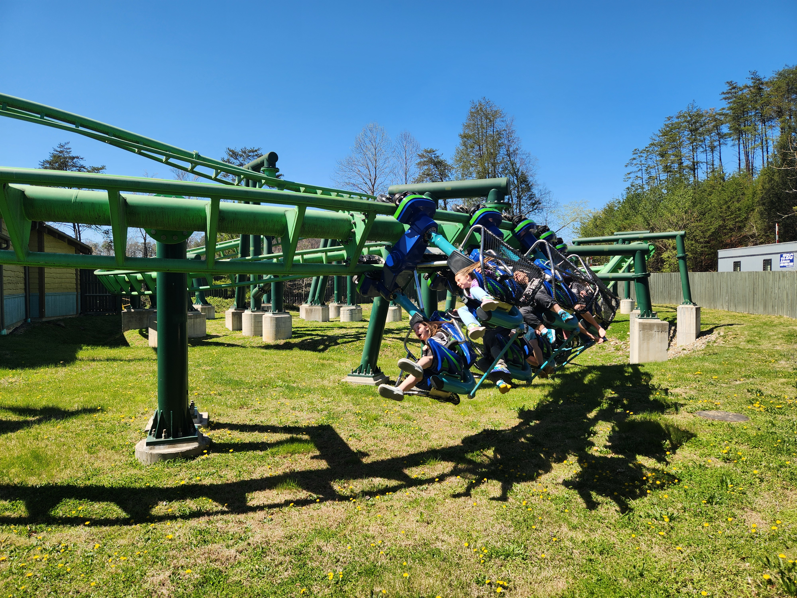

### Blazing Fury
Blazing Fury is perhaps the coaster with the most unique backstory and charm on our list. Built back when the park was known as Silver Dollar City, [by the park's own maintenance team](https://rcdb.com/501.htm), this ride is 95% dark ride and 5% coaster. I always love weird little rides like these. Journey to Atlantis at SeaWorld Orlando comes to mind. I like this ride a lot for what it is, the animatronics are cute, and the two small drops in the dark near the end of the ride certainly take you by surprise. Another thing of note is that loose articles were not only permitted, but in my case, were encouraged to be brought on this coaster. "You can bring your bags on this one," the ride operator told me. An extremely memorable experience for sure.

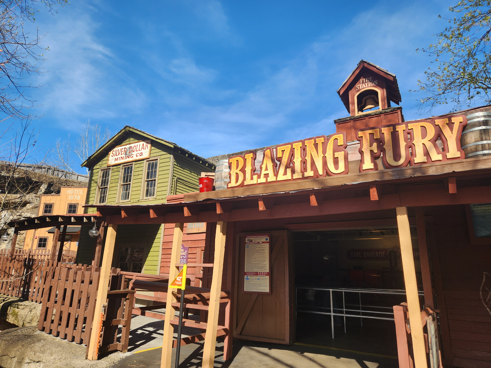

### Tennessee Tornado
Growing up with the home park of Six Flags Over Georgia, Arrow Dynamics was always a mine train manufacturer in my eyes. Of course, after riding a few of their larger scale rides like Loch Ness Monster and Demon, I know this not to be the case. Loch Ness Monster made me love Arrow — Demon made me doubt them. This ride falls somewhere in the middle. It's certainly thrilling: the positive g-forces caused me to gray out both times I got on this coaster. But as a full experience, I think that it's... just okay; the intensity is truly the only memorable part of Tennessee Tornado. It's not a theatrical event like Loch Ness and it's not a blink-and-you'll-miss-it dud of a ride like Demon (sorry Demon fans), but this coaster doesn't have anything too great or unique about it.

### Wild Eagle
Perhaps controversially, I don't think the wing coaster archetype is all too amazing in and of itself. I love the near-miss elements that they can provide, as seen on X-Flight and Gatekeeper, but that's the most amazing part of the model to me. Wild Eagle is a B&M wing coaster with no near-miss moments. What remains, however, is fine: the pacing is really well-done and the inversions are fun, but the omission of those near-miss elements really detracts from what I love about the wing coaster model. The grand scale of the coaster, the theming (mostly referring to the really cool metal eagle statue outside the ride here), and the merits of the wing position in its own right are what pushes this over Tennessee Tornado in my eyes.

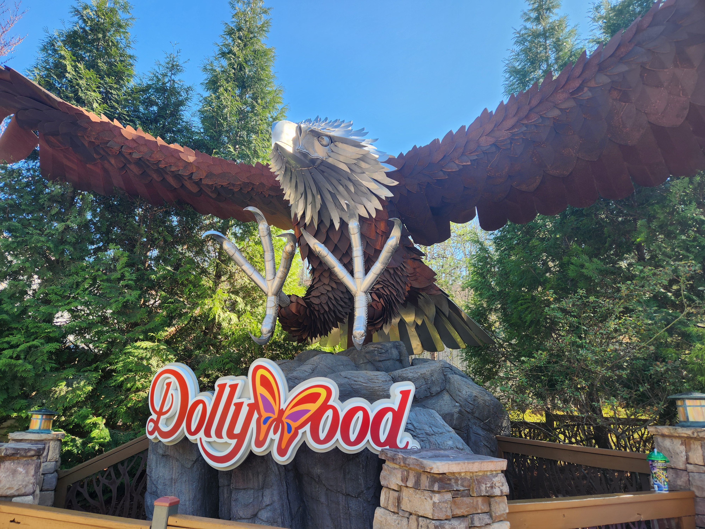

### FireChaser Express
I have indeed ranked the Gerstlauer family coaster ahead of the B&M with the 135ft drop. I'm a sucker for theming, and this ride delivers on it. Despite not sharing a manufacturer, I can only relate this ride to Cheetah Hunt at Busch Gardens Tampa, as nothing else comes close to sharing this very specific mix of launches and storytelling and sense of joy and adventure. I really, really don't want to spoil this ride for anyone who hasn't been to Dollywood yet, so I won't go into too much detail, but there is an excellently choreographed surprise sequence midway through that pushes this way up on the list and firmly in my memory. I love this thing so much; it makes me smile a lot. If you aren't likely to be anywhere near Tennessee in the foreseeable future, I would encourage you to go watch a POV of this ride.

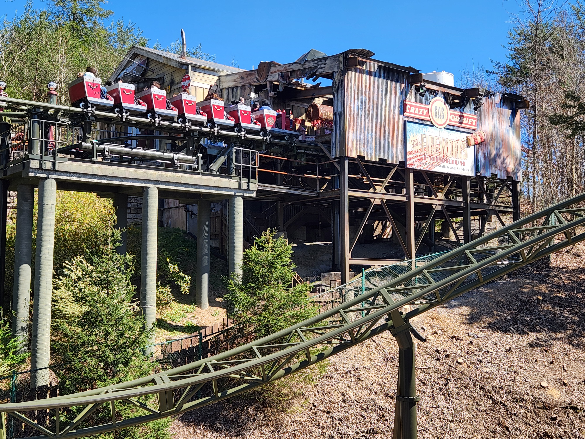

### Big Bear Mountain
With almost all of the theming and storytelling of the last entry, and even faster launches and thrills, we have Big Bear Mountain, Dollywood's newest coaster, taking up the #3 spot. Despite the admittedly desolate landscaping surrounding the track, the theming elements in the queue house and on-board audio do a fantastic job of selling you the idea that you are going on some sort of adventure in the woods to hunt down the eponymous Big Bear. The three launches, the moment where you fly under a waterfall, and the constant low-to-the-ground turns make this an amazing and re-rideable coaster, even if it isn't the most thrilling on our list.

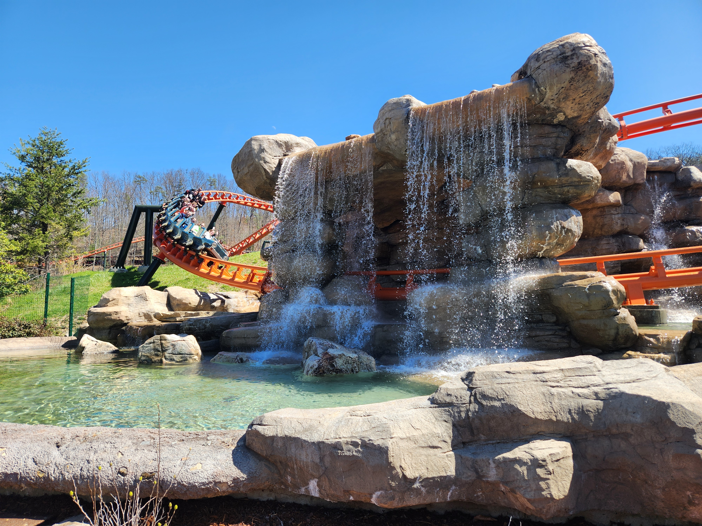

### Lightning Rod
Few coasters have a history as storied as Lightning Rod. Originally released as the world's first launched wooden roller coaster, there's a fair argument to be made that it no longer meets either of the criteria to be described as such. Eight years after its release, the notoriously problematic LSM lift hill was replaced with a more traditional chain lift, and, as per the [rcdb listing for Lightning Rod](https://rcdb.com/13369.htm), "During the 2020/2021 off-season ... the majority of track and specifically the record-setting areas (lift hill / drop) were changed from wood to steel." Nevertheless, an RMC is an RMC, and this is a great one. The mountainside setting makes this an absolutely wonderful experience, and the quad-down is deserving of its status as one of the single most acclaimed coaster elements of all time. I never rode Lightning Rod's previous revisions, but I must say, if what I experienced on my visit was combined with an LSM launch, it would certainly place Lightning Rod over our winner in this coaster ranking. That being said, this is definitely a top 15 coaster at least for me, and I would love to get to marathon it on future visits.

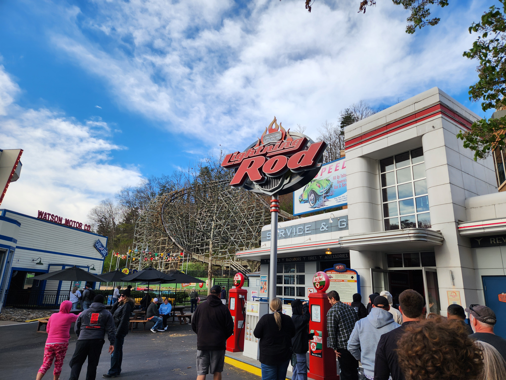

### Thunderhead
Topping my ranking of Dollywood's coasters is Thunderhead. This GCI wooden coaster is frankly incredible. I have never felt such a thrilling, out-of-control sensation on any wooden coaster while also being surprisingly comfortable. Yes, comfortable. GCI's Millennium Flyer Trains are absolutely incredible and every time I ride another coaster that features them, I cannot stop thinking about how cozy of an experience they provide, even while barreling down a 100-foot drop at 53 miles an hour. In spite of the superior airtime of Rampage at Alabama Adventure, this ride has now taken the spot as my new favorite wooden coaster. Thunderhead's laterals and sheer sense of speed, while still remaining consistently smooth, push this coaster into elite territory in my eyes. My only issue with this ride is that after three rides in a row, you might be a bit too lightheaded to go on the fourth ride you'd otherwise want.

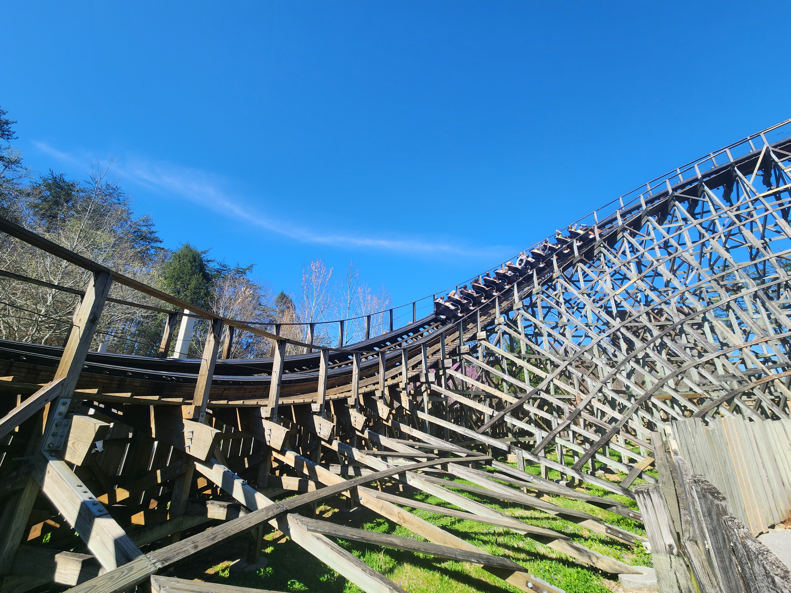

## Non-Coaster Attractions

---

### Flat Rides

Dollywood, being a park that mainly targets families rather than enthusiasts, doesn’t have a huge selection of thrilling flat rides. The only two I would really classify as “highly thrilling” are Drop Line, the park’s Funtime Drop Tower, and Barnstormer, their S&S Screamin’ Swing. Both of these are fun, solid rides, but they’re nothing special in their respective categories. Drop Line makes me miss the tilting action that many Intamin Drop Towers have, and Barnstormer is just a bit shorter than the attractions that made me love this ride model – both of the Busch Gardens “Flyers“.

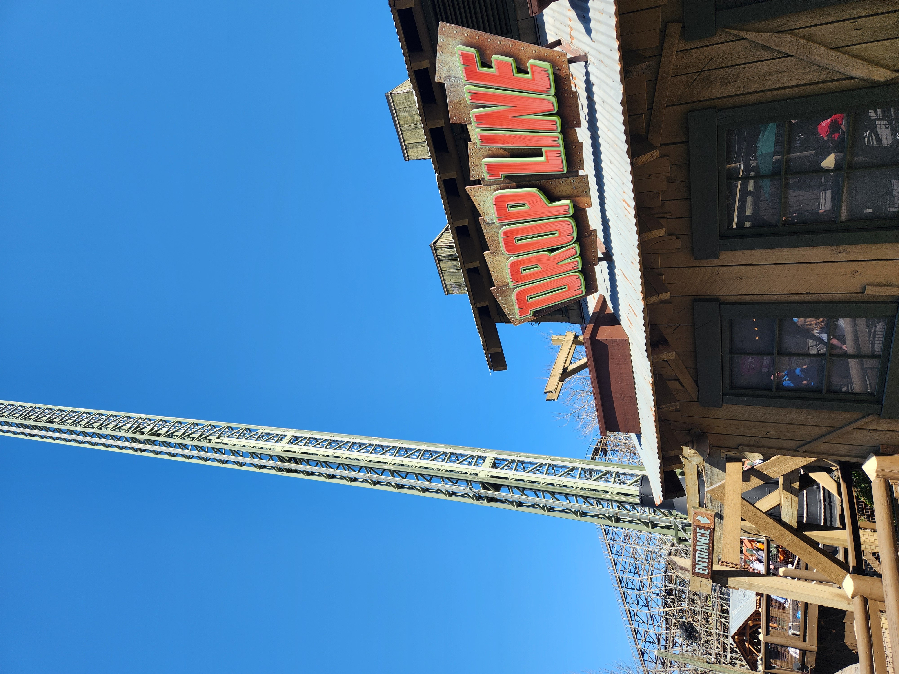

That being said, the park’s focus on family-friendly fun rather than pure thrills isn’t a bad thing! Sure, there are plenty of kid’s flat rides that I would probably not fit into or even be allowed on if I wanted to ride them, but there are also rides like Rockin’ Roadway and Black Bear Trail which are silly and awesome no matter what age you are. Riding tiny 50s-style tracked cars and rocking back and forth on those cute little bears brought me lots of joy, and I wouldn’t pass these rides up if there’s not much of a wait for them.

  

I also got on one water ride, the Smoky Mountain River Rampage. Despite being an older River Rapids attraction, I found the course to be fun and exciting with plenty of splash moments. It might not have all the wacky things like elevator lifts and halfpipes that Intamin is putting in their newer River Rapids rides, but it’s something I would recommend to anyone who likes to get wet while at a theme park and wants to take a break from the coasters for a bit.

### Dolly Parton Stuff

Dollywood wouldn't be Dollywood if it wasn't for Dolly Parton herself, and this park has no shortage of Dolly-related theming and attractions. The Dolly Parton Experience section of the park is probably the best example of this, feauturing several walk through attractions. My favorite one of these was the one that showed off lots of Dolly's different outfits she's worn on stage and at different events over the years. The tour bus walk-through was awesome as well. In addition to this section, Dolly's music is heard literally everywhere in the park and really sets a nice atmosphere, and you can view a replica of her childhood home in the Rivertown Junction area of the park.

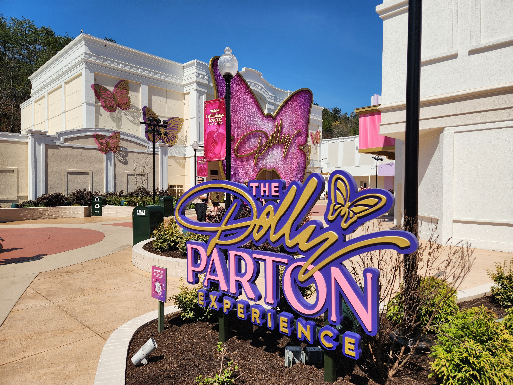
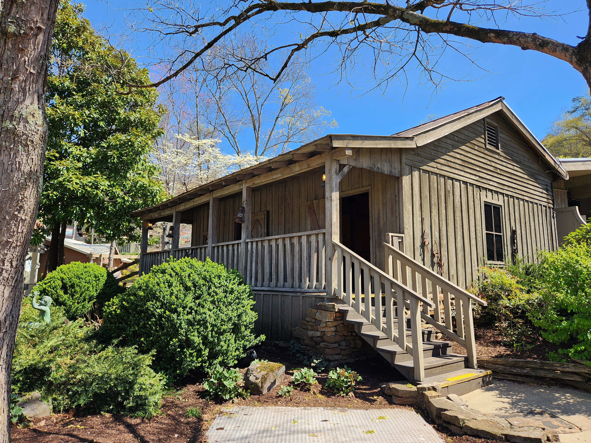

## Food

---

Honestly some of the best theme park food I have ever had. I went during a festival of some kind that had unique food offerings attached to it and everything I had I enjoyed a lot. I especially would recommend trying out their pastries, their cinnamon bread of course, but also their other offerings. Everything sweet that I tried here was amazing. That's not to say that the savory meals were any less good, though. My favorite meal was probably the Chicken Alfredo Bread Bowl I had, which was one of the limited offerings.

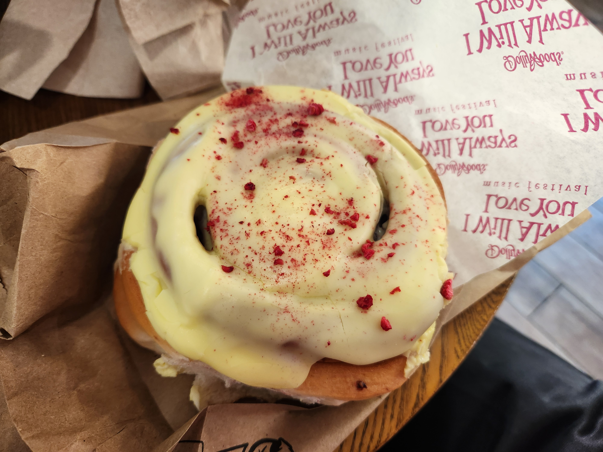

## Final Thoughts

---

Dollywood is up there as one of my favorite parks I've visited. Not for the thrills alone but for the overall atmosphere. I would love to visit this park in the autumn, during their Harvest Festival, as the nature surrounding this park really contributes a lot to the overall feeling of the place. I would highly recommend anyone making a trip to visit the more thrilling Carowinds and Six Flags Over Georgia parks to make a stop at Dollywood as well, if for no other reason than to ride Thunderhead and Lightning rod. And to eat the cinnamon bread.