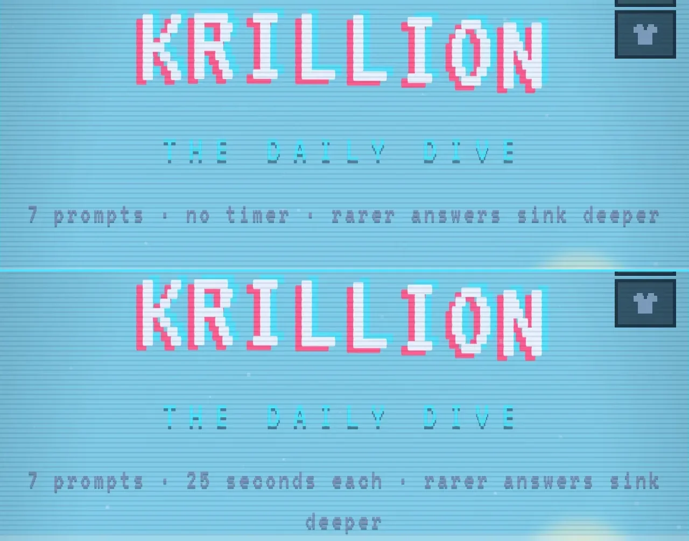
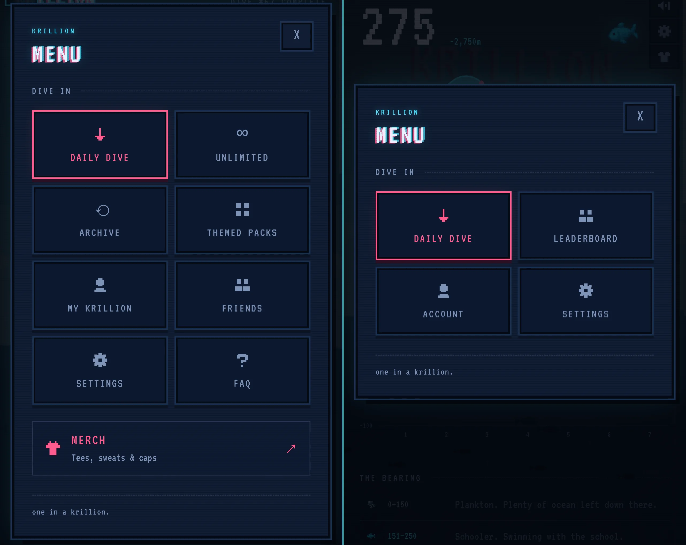
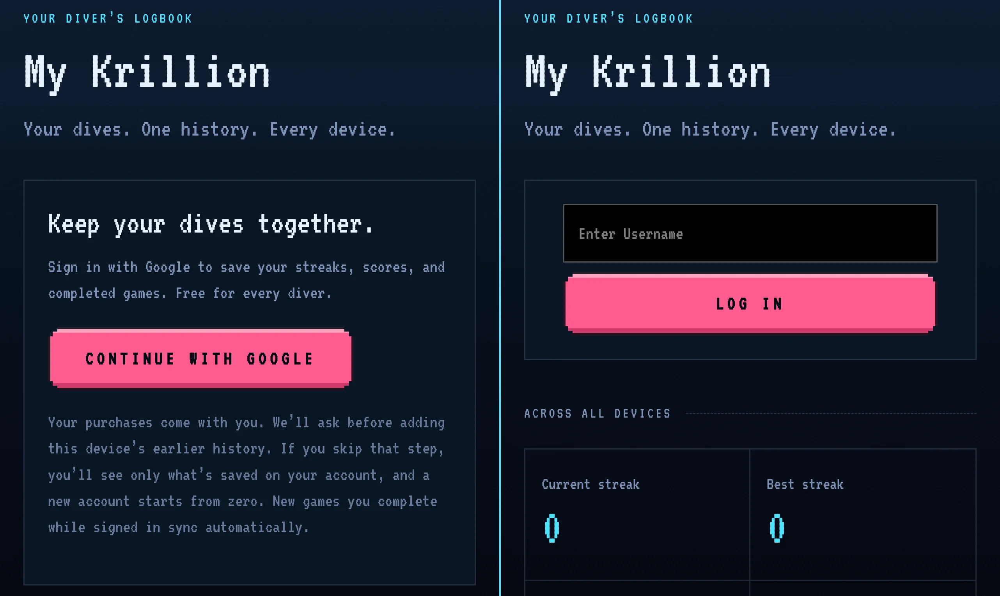
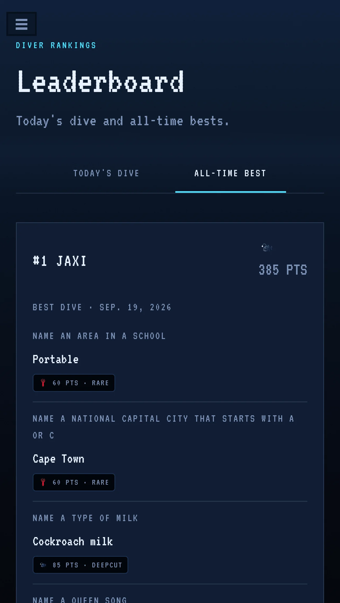

+++
title = "Making Krillion Less Stressful"
date = "2026-09-20"
description = "modding my favorite daily game to make it less frustrating"
tags = ["technology", "dev", "games", "self-hosting"]
images = ["main.webp"]
toc = false
+++
Krillion has quickly become my favorite daily game, my favorite of the *dles*, if you will. Seven prompts, rarer answers score higher. But there's the clock. Ticking, ever-present, imposing. Stressful. For each prompt you are allotted 25 seconds, and personally, this makes the game a tad less fun. Don't get me wrong, I fully understand that this is part of the difficulty, and likely the appeal of this game to others, but my autism disagrees with it.

My girlfriend feels strongly about this issue as well. To the point where she said it was ruining an otherwise perfect game. When we played our first few games together, it was so much fun, but slowly, the timer put a damper on her enjoyment of the game. I hated that this demonic countdown was hurting her and ruining our special moments! I couldn't stand for her torture. I needed her to have fun and feel joy and take 10 minutes to try and get a One in a Krillion answer. I knew I had to do something.

## Non-Technical Explanation/TL;DR

---

*Krillion - Zen Edition* is a modpack for Krillion that you can easily deploy if you want. It removes the timer, replaces the Google login with a local username-only account system, and adds a leaderboard with daily and all-time best scores for all users on your mirror.

You can check out the repository [here!](https://github.com/cmyksoda/Krillion-Zen) <3

## Technical Explanation: Solving the Problem

---

Everything below is bundled into a `setup.sh` you can run to host this yourself, more on that later.

The idea is simple, we `wget` a copy of the live site, oops, wait, it's missing a bunch of assets. Okay, okay `curl` those so we aren't missing the boat and the sun and the cute little creatures. Then strip the krillion.io-specific `?` and `%3F` bits from the request URLs to trick our mirror into thinking our assets are the same as the live site.

Now the website exists locally, time to mod it! Three JavaScript files turn Krillion into *Krillion - Zen Edition*.

First, `apply_mods.js` has two jobs:
- It removes the countdown timer, including all references to it
- Culls the menu to the essentials: paid options, FAQ, merch, privacy policy, and share links are all removed

Next, `local-auth.js` replaces the Google OAuth flow with an insecure-by-design username system, and ensures that our mods stay intact:
- Usernames are case-insensitive, shared across devices, and kept in a local SQLite database
- Copies our React UI changes from earlier into the MutationObserver overlay so that they are certain to work
- Adds a skip button in place of the timer in case you get stuck

Lastly, `server.js` *is* our site, it:
- Serves our copy we fetched way earlier
- Proxies Krillion's generously-provided API for questions and answers
- Reads from and writes to our SQLite database, which our bash script `touch`es so that Docker doesn't try and make a database folder later

### Leaderboard
An additional feature, one that the real site has, but that I have no knowledge of. You have to sign in with Google and get your friends to accept a link and it's just too silly for me to mess with. Our `/leaderboard` page copies the layout of `/account` from the base site, and modifies it.

We have two tabs: one for today's game, and one for the highest score on any day for each player. Both are gated behind the user having completed the Daily Dive, because otherwise, they would (or could, in the case of the all-time bests) see the answers!

### Deployment 
I made this into a Dockerized setup for ease-of-use and isolation from the rest of my system. You know, as you do. After running `setup.sh`, `docker compose up -d` spins up the server at `localhost:3030`, and if you ever need to update it (e.g. krillion.io changes dramatically one day and you have to fetch the whole site again), rerun with the `--build` flag.

## Very Important Legal Disclaimer

---

**Please do not host this publicly.**

Krillion is copyrighted and not free-to-redistribute, so keep this on LAN or Tailscale for you and your friends to use. :3
